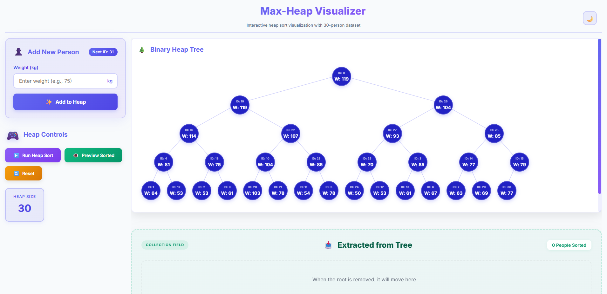
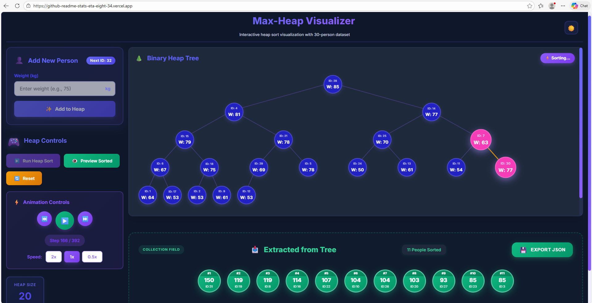

# 🎯 Max-Heap Visualizer

A professional, interactive React application designed to visualize Max-Heap data structures and the Heap Sort algorithm. This tool provides a high-fidelity, educational experience through smooth, physics-based animations.

🚀 **Live Site:** [https://github-readme-stats-eta-eight-34.vercel.app](https://github-readme-stats-eta-eight-34.vercel.app)

---

## 📸 Project Screenshots

### 1. Initial Heap State
*The application starts with a pre-loaded dataset of 30 people, automatically balanced into a valid Max-Heap.*

<!-- 📸 PLACEHOLDER: Initial heap tree with 30 persons -->


### 2. Adding a New Person
*Experience real-time "Heapify-Up" animations with clear highlight indicators for comparisons and swaps.*

<!-- 📸 PLACEHOLDER: Adding a new person (with visible swaps / animation) -->


### 3. Heap Sort Process & Results
*View step-by-step extractions as the maximum element is removed and the tree is reorganized into a sorted list.*

<!-- 📸 PLACEHOLDER: Heap sort steps and final sorted list -->


---

## ✨ Features Implemented

- **🌳 Dynamic Binary Tree**: Real-time SVG visualization of the heap structure that adapts to any data size.
- **➕ Interactive Insertion**: Easily add new people via the **Add To Heap** form and watch the real-time **Heapify-Up** animation as they find their correct position in the tree.
- **⚡ Intuition-Based Animations**: Every insertion and extraction is broken down into comparison and swap phases with descriptive notifications.
- **⏭️ Manual Step Control**: While paused, navigate through the sorting process one step at a time using 'Previous' and 'Next' buttons.
- **⚙️ Simulation Speed**: Adjustable animation speed (500ms to 2000ms) to suit different learning paces.
- **🌓 Dark & Light Modes**: Full theme support with persistent memory using a modern glassmorphism design.
- **💾 JSON Export**: Ability to download the final sorted list of people for external use.
- **👁️ Instant Preview**: Toggle a preview of the final sorted list at any time (show/hide) without running the full animation sequence.
- **🔄 System Reset**: Instantly restore the application to its initial state with the original 30-person dataset.
- **🔍 Interactive Node Details**: Click on any node in the tree to view a detailed modal showing its position, tree level, parent, and children identifiers.
- **↕️↔️ Infinite Multi-Directional Scroll**: The visualization area automatically scales for large heaps (30+ nodes), supporting both smooth vertical and horizontal scrolling to explore the complete tree structure.
- **📱 Fully Responsive**: A seamless experience across mobile, tablet, and desktop devices.

---

## 🚀 Installation & Run Instructions

Follow these steps to set up the project locally:

1. **Clone the repository:**
   ```bash
   git clone https://github.com/marziasu/react-heap-sort-visualization.git
   cd react-heap-sort-visualization
   ```

2. **Install dependencies:**
   ```bash
   npm install
   ```

3. **Start the application:**
   ```bash
   npm start
   ```

*(The app will be available at `http://localhost:5173`)*

---

## 🛠️ Technical Details

- **React 19**: Core engine for state management and UI components.
- **Framer Motion**: Physical-based physics for node transitions and layout animations.
- **Vite 7**: Lightning-fast development and build environment.
- **Custom Max-Heap Implementation**: A robust JavaScript logic for Insert, Extract, and Heapify operations without external libraries.

---

## 👤 Author

**Marzia**

- GitHub: [@marziasu](https://github.com/marziasu)

---
